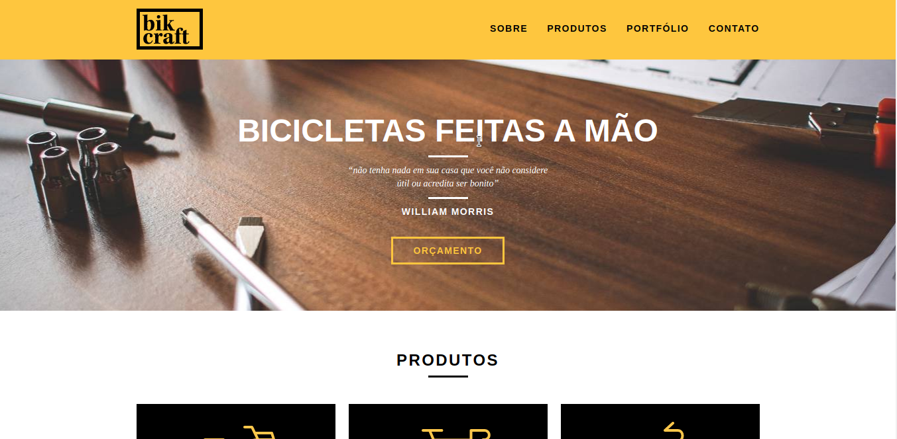

# Bikcraft

<!---Esses são exemplos. Veja https://shields.io para outras pessoas ou para personalizar este conjunto de escudos. Você pode querer incluir dependências, status do projeto e informações de licença aqui--->

>Site institucional desenvolvido no curso web design completo da Origamid.

## 💻 Tecnologias
- [x] Html5
- [x] Css3
- [x] JavaScript

## 🤝 Desenvolvedores

<!-- Agradecemos às seguintes pessoas que contribuíram para este projeto: -->

<table>
  <tr>
    <td align="center">
      <a href="#">
         
        
          <b>Marcos Nascimento</b>
        
      </a>
    </td>
  </tr>
</table>

## 📝 Licença

Esse projeto está sob licença. Veja o arquivo [LICENÇA](LICENSE.md) para mais detalhes.

[⬆ Voltar ao topo](#bikcraft) 
